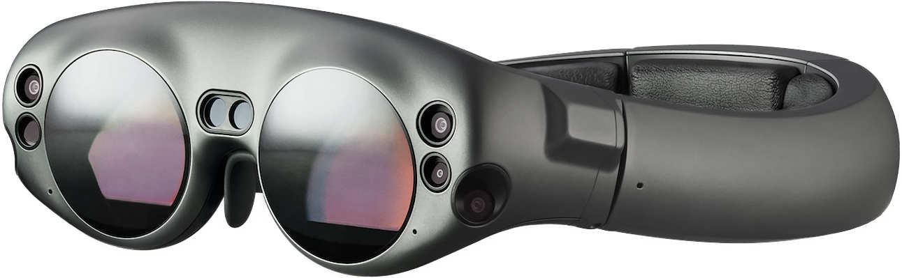

# Hacking_the-Magic-Leap-One

## Motivation:
I believe in the importance of sustainability and dislike seeing innovative technology go to waste in landfills. With that in mind, I've initiated this project to revive the Magic Leap One AR glasses. My goal is to explore avenues to extend the lifespan of this product.

## Contents
This repository will include updates, discoveries, code snippets, board X-rays, and more.

## Community Contributions
As I'm still learning, any assistance or input is greatly appreciated. Collaboration is key to progress, and I'm excited to learn from others in this endeavour.

## WIKI
For detailed information and guides, please refer to [the project's wiki](https://github.com/Tomas-Kuchta-FPV/hacking_the-Magic-Leap-one/wiki).

## Approaches
I've outlined three potential approaches to achieve our goal. Contributions and suggestions for improvement are welcome.

 1. **Dumping and Patching MLOS:** Exploring methods to extract and modify the Magic Leap Operating System.
 2. **Reverse Engineering Cloud Authentication:** Investigating the authentication handshake with cloud services for potential modifications or maybe a custom server.
 3. **Custom Bootloader and OS:** Delving into reverse engineering the board to develop a custom bootloader and operating system. Note: This is expected to be challenging.

## Acquiring the Magic Leap One
The Magic Leap One can be readily found on eBay from various sellers at reasonable prices. I'm currently in contact with a seller who is supportive of our project.

Let's breathe new life into the Magic Leap One!